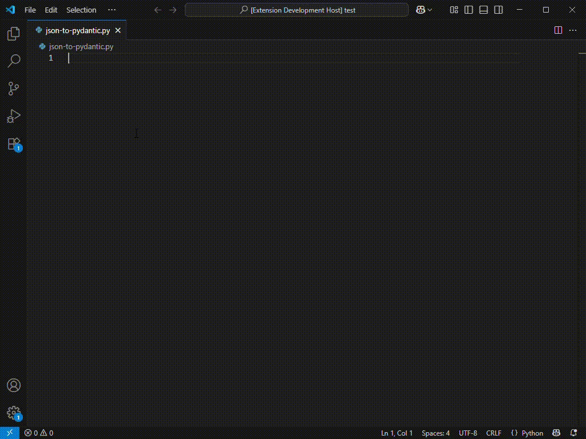
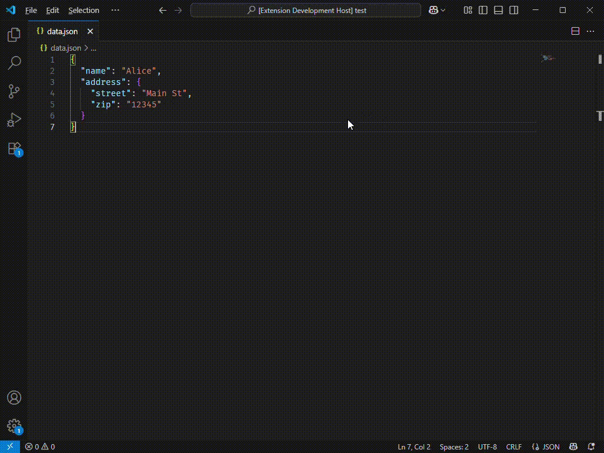

# JSON to Pydantic

Generate Pydantic models from JSON data. Inspired by [JSON to TS](https://marketplace.visualstudio.com/items?itemName=MariusAlchimavicius.json-to-ts) extension and [JSON to Pydantic](https://jsontopydantic.com/) website.

## Features

- Converts JSON data to Pydantic model classes
- Handles nested objects and arrays
- Supports Python type annotations
- Supports aliasing for camelCase fields
- Option to reuse class definitions
- Option to make fields optional
- Supports avoiding reserving Python keywords as field names
- Duplicate class name and field name prevention
- Union types and array types merging
- Indents the generated code according to the editor settings

## Usage

- **Generate Code from Clipboard** (`Ctrl + Alt + V`)


- **Generate Code from Selection** (`Ctrl + Alt + S`)


## Extension Settings

This extension provides settings to modify the generated code. They are:

| Setting | Description | Type | Default Value |
| ------- | ----------- | ---- | ------------- |
| [`json-to-pydantic.defaultRootClassName`](#json-to-pydanticdefaultrootclassname) | Defines the default name of the generated root class | `string`  | `"Model"` |
| [`json-to-pydantic.preferClassReuse`](#json-to-pydanticpreferclassreuse) | Defines whether identical class definitions will be reused from generated classes | `boolean` | `false` |
| [`json-to-pydantic.forceOptional`](#json-to-pydanticforceoptional) | Defines which classes will have their fields defined as Optional | `"None"` \| `"OnlyRootClass"` \| `"AllClasses"` | `"None"` |
| [`json-to-pydantic.aliasCamelCase`](#json-to-pydanticaliascamelcase) | Defines whether `camelCase` fields will be aliased to `snake_case` fields | `boolean` | `false` |

## Extension Settings Examples

The following JSON will be the input for all the examples that follow.

```json
{
  "id": 101,
  "title": "First Post",
  "content": "This is the content of the post.",
  "isActive": true,
  "createdAt": "2025-07-01T14:20:00Z",
  "updatedAt": "2025-07-01T15:00:00Z",
  "userProfile": {
    "userId": 501,
    "firstName": "Alice",
    "lastName": "Johnson",
    "emailAddress": "alice@example.com"
  },
  "createdBy": {
    "userId": 501,
    "firstName": "Alice",
    "lastName": "Johnson",
    "emailAddress": "alice@example.com"
  },
  "updatedBy": {
    "userId": 502,
    "firstName": "Bob",
    "lastName": "Smith",
    "emailAddress": "bob@example.com"
  },
  "tags": ["json", "example", "camelCase"],
  "metadata": {
    "viewsCount": 250,
    "likesCount": 18,
    "isFeatured": false
  }
}
```

With all default settings, the resulting code will be as follows:

```python
from __future__ import annotations

from typing import List

from pydantic import BaseModel


class UserProfile(BaseModel):
    userId: int
    firstName: str
    lastName: str
    emailAddress: str


class CreatedBy(BaseModel):
    userId: int
    firstName: str
    lastName: str
    emailAddress: str


class UpdatedBy(BaseModel):
    userId: int
    firstName: str
    lastName: str
    emailAddress: str


class Metadata(BaseModel):
    viewsCount: int
    likesCount: int
    isFeatured: bool


class Model(BaseModel):
    id: int
    title: str
    content: str
    isActive: bool
    createdAt: str
    updatedAt: str
    userProfile: UserProfile
    createdBy: CreatedBy
    updatedBy: UpdatedBy
    tags: List[str]
    metadata: Metadata
```

### `json-to-pydantic.defaultRootClassName`
It can be defined with any name, including names that are not allowed for other classes generated from the input (such as `True`, `False` or names starting with numbers), and it is the user's responsibility to avoid this. For example purposes, the defined name will be `"Root"`. If defined this way, the resulting code will be as follows:
```python
from __future__ import annotations

from typing import List

from pydantic import BaseModel


class UserProfile(BaseModel):
    userId: int
    firstName: str
    lastName: str
    emailAddress: str


class CreatedBy(BaseModel):
    userId: int
    firstName: str
    lastName: str
    emailAddress: str


class UpdatedBy(BaseModel):
    userId: int
    firstName: str
    lastName: str
    emailAddress: str


class Metadata(BaseModel):
    viewsCount: int
    likesCount: int
    isFeatured: bool


class Root(BaseModel):
    id: int
    title: str
    content: str
    isActive: bool
    createdAt: str
    updatedAt: str
    userProfile: UserProfile
    createdBy: CreatedBy
    updatedBy: UpdatedBy
    tags: List[str]
    metadata: Metadata
```

### `json-to-pydantic.preferClassReuse`

If set to `true`, the resulting code will be as follows:

```python
from __future__ import annotations

from typing import List

from pydantic import BaseModel


class UserProfile(BaseModel):
userId: int
firstName: str
lastName: str
emailAddress: str


class Metadata(BaseModel):
viewsCount: int
likesCount: int
isFeatured: bool


class Model(BaseModel):
id: int
title: str
content: str
isActive: bool
createdAt: str
updatedAt: str
userProfile: UserProfile
createdBy: UserProfile
updatedBy: UserProfile
tags: List[str]
metadata: Metadata
```

### `json-to-pydantic.forceOptional`

There are three options to this setting: `"None"`, `"OnlyRootClass"` and `"AllClasses"`. `"None"` is the default option, so if set to this option, the resulting code will be like the default example code shown above. Following is the resulting code for the other options:

- `"OnlyRootClass"`: `Optional[...]` will only be set to the root class.

    ```python
    from __future__ import annotations

    from typing import List, Optional

    from pydantic import BaseModel


    class UserProfile(BaseModel):
        userId: int
        firstName: str
        lastName: str
        emailAddress: str


    class CreatedBy(BaseModel):
        userId: int
        firstName: str
        lastName: str
        emailAddress: str


    class UpdatedBy(BaseModel):
        userId: int
        firstName: str
        lastName: str
        emailAddress: str


    class Metadata(BaseModel):
        viewsCount: int
        likesCount: int
        isFeatured: bool


    class Model(BaseModel):
        id: Optional[int] = None
        title: Optional[str] = None
        content: Optional[str] = None
        isActive: Optional[bool] = None
        createdAt: Optional[str] = None
        updatedAt: Optional[str] = None
        userProfile: Optional[UserProfile] = None
        createdBy: Optional[CreatedBy] = None
        updatedBy: Optional[UpdatedBy] = None
        tags: Optional[List[str]] = None
        metadata: Optional[Metadata] = None
    ```
- `"AllClasses"`: `Optional[...]` will be set to all generated classes.
    ```python
    from __future__ import annotations

    from typing import List, Optional

    from pydantic import BaseModel


    class UserProfile(BaseModel):
    userId: Optional[int] = None
    firstName: Optional[str] = None
    lastName: Optional[str] = None
    emailAddress: Optional[str] = None


    class CreatedBy(BaseModel):
    userId: Optional[int] = None
    firstName: Optional[str] = None
    lastName: Optional[str] = None
    emailAddress: Optional[str] = None


    class UpdatedBy(BaseModel):
    userId: Optional[int] = None
    firstName: Optional[str] = None
    lastName: Optional[str] = None
    emailAddress: Optional[str] = None


    class Metadata(BaseModel):
    viewsCount: Optional[int] = None
    likesCount: Optional[int] = None
    isFeatured: Optional[bool] = None


    class Model(BaseModel):
    id: Optional[int] = None
    title: Optional[str] = None
    content: Optional[str] = None
    isActive: Optional[bool] = None
    createdAt: Optional[str] = None
    updatedAt: Optional[str] = None
    userProfile: Optional[UserProfile] = None
    createdBy: Optional[CreatedBy] = None
    updatedBy: Optional[UpdatedBy] = None
    tags: Optional[List[str]] = None
    metadata: Optional[Metadata] = None
    ```

### `json-to-pydantic.aliasCamelCase`

If set by `true`, `camelCase` fields will be aliased to `snake_case` fields.

```python
from __future__ import annotations

from typing import List

from pydantic import BaseModel, Field


class UserProfile(BaseModel):
user_id: int = Field(..., alias='userId')
first_name: str = Field(..., alias='firstName')
last_name: str = Field(..., alias='lastName')
email_address: str = Field(..., alias='emailAddress')


class CreatedBy(BaseModel):
user_id: int = Field(..., alias='userId')
first_name: str = Field(..., alias='firstName')
last_name: str = Field(..., alias='lastName')
email_address: str = Field(..., alias='emailAddress')


class UpdatedBy(BaseModel):
user_id: int = Field(..., alias='userId')
first_name: str = Field(..., alias='firstName')
last_name: str = Field(..., alias='lastName')
email_address: str = Field(..., alias='emailAddress')


class Metadata(BaseModel):
views_count: int = Field(..., alias='viewsCount')
likes_count: int = Field(..., alias='likesCount')
is_featured: bool = Field(..., alias='isFeatured')


class Model(BaseModel):
id: int
title: str
content: str
is_active: bool = Field(..., alias='isActive')
created_at: str = Field(..., alias='createdAt')
updated_at: str = Field(..., alias='updatedAt')
user_profile: UserProfile = Field(..., alias='userProfile')
created_by: CreatedBy = Field(..., alias='createdBy')
updated_by: UpdatedBy = Field(..., alias='updatedBy')
tags: List[str]
metadata: Metadata
```

## Release Notes

### 0.0.1

Initial release of JSON to Pydantic extension.

## More Information

- [Repo](https://github.com/caioyuri99/json-to-pydantic-code-generator)
- [Issues](https://github.com/caioyuri99/json-to-pydantic-code-generator/issues)
- [Change log](https://github.com/caioyuri99/json-to-pydantic-vscode-extension/blob/main/CHANGELOG.md)

